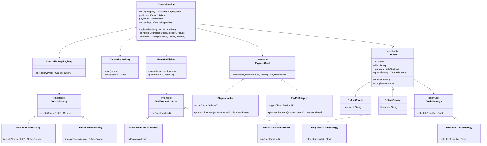
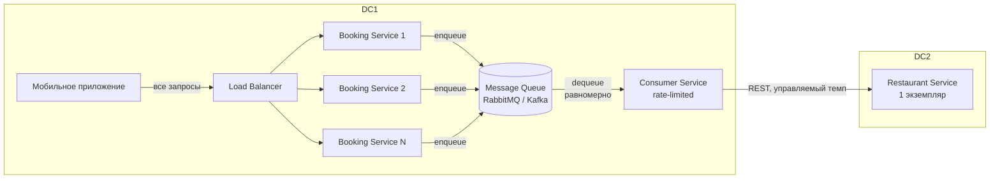

# Архитектура сервисов и приложений

# Задание 1

## 1. Краткий анализ исходной системы

В классе `CourseManager` сосредоточены сразу несколько несвязанных обязанностей: создание объектов, хранение данных, расчёт оценок, отправка уведомлений и оплата. Это нарушает принцип единственной ответственности (SRP) и делает класс точкой роста сложности при любом изменении требований

**Выявленные проблемы:**
1. **God Object** - `CourseManager` слишком много знает и делает
2. **Жёсткое ветвление при создании курсов** - `if/else if` по типу курса; добавление нового типа требует изменения существующего кода (нарушение OCP)
3. **Негибкий алгоритм расчёта оценки** - один метод на все курсы, нельзя заменить без изменения класса
4. **Встроенные уведомления** - `sendEmail(...)` прямо в бизнес-логике; добавление другого канала требует изменений
5. **Прямая зависимость от платёжного API** - смена провайдера требует изменений во всём классе
6. **Дублирование логики** - похожие операции повторяются в разных методах

---

## 2. Предлагаемая архитектура

### Диаграмма классов

---

## 3. Описание основных классов и их ответственность

| Класс / Интерфейс | Ответственность |
|---|---|
| `CourseFactory` (interface) | Контракт создания курсов |
| `OnlineCourseFactory`, `OfflineCourseFactory` | Создание конкретного типа курса |
| `CourseFactoryRegistry` | Возвращает нужную фабрику по типу курса и устраняет необходимость `if/else` |
| `Course` (abstract) | Базовая сущность курса, хранит список студентов и стратегию оценки |
| `GradeStrategy` (interface) | Контракт алгоритма расчёта оценки |
| `WeightedGradeStrategy`, `PassFailGradeStrategy` | Конкретные алгоритмы расчёта |
| `EventPublisher` | Управляет подписками и публикует события (регистрация, завершение курса) |
| `NotificationListener` (interface) | Контракт обработчика уведомлений |
| `EmailNotificationListener`, `SmsNotificationListener` | Отправка уведомлений по конкретному каналу |
| `PaymentPort` (interface) | Изолированный контракт взаимодействия с платёжным сервисом |
| `StripeAdapter`, `PayPalAdapter` | Адаптация конкретного внешнего API под `PaymentPort` |
| `CourseService` | Application-сервис: оркестрирует бизнес-сценарии |
| `CourseRepository` | Хранение и получение курсов, отвечает только за сохранение и загрузку данных о курсах, отделяя бизнес-логику от хранения |

---

## 4. Паттерны и их роль

**Factory Method** - `CourseFactory` с реализациями `OnlineCourseFactory` / `OfflineCourseFactory` и `CourseFactoryRegistry`, который возвращает нужную фабрику по типу курса. Это убирает `if/else if` по типу курса из `CourseService` и инкапсулирует создание конкретных типов курсов. Добавление нового типа курса - это добавление новой фабрики без изменения существующего кода (OCP)

**Strategy** - `GradeStrategy` с реализациями `WeightedGradeStrategy` / `PassFailGradeStrategy`. Алгоритм расчёта оценки вынесен из `CourseService` и передаётся курсу при создании. Замена алгоритма не затрагивает бизнес-логику

**Observer** - `EventPublisher` с набором `NotificationListener`. `CourseService` после выполнения бизнес-операции публикует события (`courseCompleted`, `studentEnrolled`) через `EventPublisher`; все подписанные слушатели реагируют независимо. Добавление нового канала = новый `NotificationListener` без изменения `CourseService`

**Adapter** - `PaymentPort` (интерфейс) + `StripeAdapter` / `PayPalAdapter`. Бизнес-логика зависит только от `PaymentPort`, а не от конкретных SDK платёжных систем, что соответствует Dependency Inversion Principle; внешний платёжный API полностью скрыт за адаптером. Смена провайдера = новый адаптер

---

## 5. Таблица соответствия проблем и решений

| Проблема | Решение | Паттерн | Обоснование |
|---|---|---|---|
| God Object - всё в `CourseManager` | Разбиение на `CourseService`, `CourseRepository`, `EventPublisher`, адаптеры | SRP + разделение на классы | Каждый класс отвечает за одну область |
| `if/else if` при создании курсов | Иерархия `CourseFactory` с конкретными фабриками | Factory Method | Новый тип курса = новая фабрика, старый код не меняется |
| Жёсткий алгоритм оценки | Интерфейс `GradeStrategy`, передаётся курсу при создании | Strategy | Алгоритм заменяется независимо от остального кода |
| `sendEmail(...)` встроен в логику | `EventPublisher` + `NotificationListener`; логика публикует событие, а не вызывает `sendEmail` | Observer | Добавление/замена канала уведомлений без изменения `CourseService` |
| Прямая зависимость от платёжного API | `PaymentPort` скрывает API; `StripeAdapter` / `PayPalAdapter` - конкретные реализации | Adapter | Смена платёжного провайдера не затрагивает бизнес-логику |
| Дублирование логики | Общая логика вынесена в `Course` (abstract), `CourseService` и переиспользуемые компоненты | DRY | Повторяющийся код находится в одном месте и переиспользуется |

---

## 6. Вывод

Исходный `CourseManager` является классическим God Object с шестью разными видами ответственности. Применение четырёх паттернов (Factory Method, Strategy, Observer, Adapter) позволяет разделить систему на независимые части: каждая проблема устраняется конкретным паттерном. В результате добавление новых типов курсов, каналов уведомлений или платёжных провайдеров не требует изменения существующего кода, что соответствует принципам OCP, SRP и DRY

---

# Задание 2

## Центральная проблема 1: Синхронная связанность между сервисами при пиковой нагрузке

**Описание проблемы.** Сервис бронирований синхронно вызывает сервис ресторанов по REST при каждом запросе. При пиковой нагрузке (50 000 RPS) сервис ресторанов не способен обработать такое количество запросов одновременно и падает. Падение сервиса ресторанов немедленно приводит к ошибкам у пользователей, поскольку сервис бронирований ждёт синхронного ответа

**Решение: переход на асинхронную обработку через очередь сообщений**

Между сервисом бронирований и сервисом ресторанов вводится очередь сообщений (например, RabbitMQ или Kafka), расположенная в ДЦ1. Сервис бронирований при получении запроса не вызывает сервис ресторанов напрямую, а записывает заявку в очередь и немедленно возвращает пользователю ответ «заявка принята». Отдельный consumer-сервис (в ДЦ1) читает сообщения из очереди и вызывает сервис ресторанов с управляемой скоростью - не превышая его пропускную способность

Аналитики установили, что при равномерной нагрузке сервис ресторанов потреблял бы лишь 20% мощностей. Consumer регулирует темп потребления (rate limiting / throttling), сглаживая пики. Таким образом создаётся механизм backpressure: скорость обращений к сервису ресторанов ограничивается и подстраивается под его пропускную способность, предотвращая перегрузку единственного экземпляра сервиса. Все заявки, поступившие за 10-15 минут пиковой нагрузки, накапливаются в очереди и обрабатываются в течение нескольких часов - укладываясь в допустимые бизнесом 24 часа. Использование Outbox pattern позволяет избежать ситуации, когда запись о бронировании сохранилась, а сообщение в очередь не отправилось или наоборот. Использование idempotency key позволяет безопасно обрабатывать повторную доставку сообщений и избегать дублирования бронирований

### Схема решения

---

## Центральная проблема 2: Несбалансированная маршрутизация при зашитых IP-адресах

**Описание проблемы.** Мобильное приложение хранит список IP-адресов в фиксированном порядке и всегда идёт сверху вниз. При пиковой нагрузке весь трафик обрушивается на первый экземпляр, затем на второй и т.д. - последовательно роняя каждый. Нагрузка не распределяется равномерно между экземплярами

**Решение: перенаправление зашитых IP-адресов на балансирующий слой**

Поскольку IP-адреса зашиты в коде приложения и обновить его быстро невозможно, на сетевом уровне настраивается перенаправление (например, через NAT, VIP, reverse proxy или аналогичный механизм), при котором все зашитые IP-адреса принимаются балансирующим слоем в ДЦ1. Приложение продолжает обходить свой список как раньше, но фактически каждый адрес ведёт на балансирующий слой - который уже равномерно распределяет запросы между экземплярами сервиса бронирований

Балансировщик распределяет входящую нагрузку между большим количеством экземпляров сервиса бронирований, которые можно масштабировать горизонтально. Для этого сервис бронирований должен оставаться stateless, чтобы экземпляры можно было независимо добавлять и удалять при росте нагрузки

Это решение не требует обновления мобильного приложения и работает с уже зашитыми IP. Переход на единый DNS-адрес в будущих версиях приложения - желательное, но не срочное улучшение

---

# Задание 3

**Что архитектурно неудачно:**
Бизнес-логика (расчёт скидки, проверка льгот, обработка заявок) напрямую смешана с инфраструктурными деталями: HTTP-слоем, ORM, SQL-запросами, конкретными внешними API. Это означает, что при смене технической детали - например, замене ORM или переходе на другой API - приходится трогать код, который описывает бизнес-правила. Это нарушает принцип инверсии зависимостей: высокоуровневые правила зависят от низкоуровневых деталей. Тестирование бизнес-логики невозможно без поднятия базы данных и HTTP-инфраструктуры

**Какой подход уместен:**
Чистая архитектура (Clean Architecture) или близкая к ней гексагональная архитектура (Ports & Adapters). Центральная идея: бизнес-логика вынесена в изолированное ядро (domain/use-case слой), которое не импортирует ничего из инфраструктуры. Инфраструктурный код (репозитории, HTTP-клиенты, ORM-маппинги) реализует интерфейсы, объявленные в ядре, а не наоборот

**За счёт чего решается проблема:**
Бизнес-правила (расчёт скидки, проверка льгот) становятся чистыми функциями или классами без зависимостей на HTTP или SQL. При смене базы данных меняется только реализация репозитория, а не логика расчёта скидки. Тесты на бизнес-логику запускаются без инфраструктуры - быстро и надёжно. Изменение внешнего API затрагивает только соответствующий адаптер. В такой архитектуре зависимости направлены внутрь системы: инфраструктура зависит от бизнес-ядра, а не наоборот

---

# Задание 4

**Проблема:** команда не имеет единой картины состояния системы, узнаёт об инцидентах от пользователей, а логи теряются при перезапуске контейнеров

**Предлагаемые инструменты и практики:**

**1. Централизованный сбор логов (например, ELK-стек: Elasticsearch + Logstash/Fluentd + Kibana или аналог Loki + Grafana).**
Логи из всех контейнеров пересылаются в центральное хранилище в реальном времени, а не хранятся локально. После перезапуска контейнера все его логи уже сохранены централизованно - ничего не теряется. Это устраняет проблему потери логов и делает разбор инцидентов возможным даже для уже перезапущенных контейнеров

**2. Метрики и дашборды (например, Prometheus + Grafana)**
Каждое приложение экспортирует метрики (latency, error rate, CPU, memory, количество перезапусков контейнеров). Prometheus собирает их по расписанию, Grafana строит дашборды. Команда видит деградацию в реальном времени - до того, как пользователи начнут жаловаться. Это устраняет отсутствие единой картины по метрикам

**3. Алертинг (Alertmanager в связке с Prometheus или аналог)**
На основе метрик задаются пороговые правила: если p99 latency превышает X мс или количество перезапусков контейнера за час превышает N - команда получает уведомление в Slack / email. Это устраняет ситуацию «узнали от пользователей» и переводит команду в режим проактивного реагирования

**4. Распределённая трассировка (например, Jaeger или Zipkin, с инструментацией через OpenTelemetry)**
Каждый запрос получает уникальный trace ID, который передаётся между сервисами. При инциденте можно найти конкретный запрос и увидеть полный путь его прохождения - где возникла задержка или ошибка. Это устраняет трудность разбора инцидентов в распределённой среде, где проблема может быть в любом из нескольких сервисов

**5. Централизованный сбор событий о перезапусках контейнеров (через систему оркестрации, например Kubernetes Events + интеграция с системой алертинга)**
Каждый перезапуск контейнера генерирует событие, которое попадает в систему мониторинга. Команда видит историю перезапусков в дашборде и получает алерт при аномальном поведении. Это устраняет ситуацию, когда факт перезапуска обнаруживается случайно

**6. Health checks и probes (liveness/readiness probes)**
Liveness probes позволяют автоматически обнаруживать зависшие экземпляры и перезапускать их, а readiness probes помогают исключать деградировавшие контейнеры из обработки трафика. Это уменьшает влияние проблемных экземпляров на пользователей и ускоряет восстановление системы
